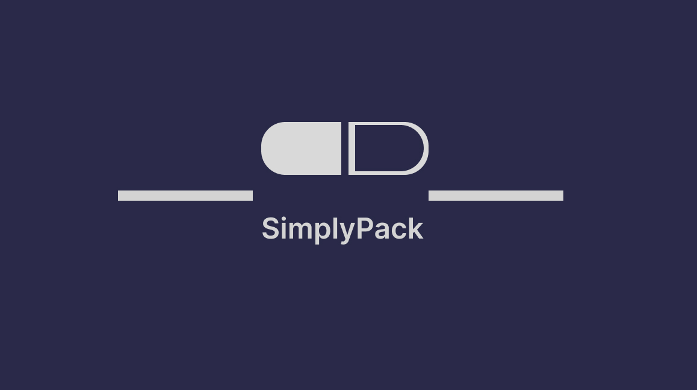

# SimplyPack Prototype 💊💊 - HackRX2023 Submission

`SimplyPack` aims to make the production of in-store blister packs more efficient for the pharmacy staff and safer for the patients. Our software streamlines the blister packaging process into a few simple steps, ultimately reducing the possibility for error and allowing for a smoother workflow in the pharmacy.

## Features
- Able to view each patient profile awaiting blister-packs 
- - `Medication` image will pop up, allowing pharmacy staff to know if they picked the correct medicine
- Medication image will move to correct spot on grid - pharmacy staff will know what the finished blister-pack should look like 
- Helps pharmacists during verification process
- ```[Not implemented in prototype 🚧]``` Must scan barcode of each bottle / box - if wrong medication selected, system will not let you continue 
- ```[Not implemented in prototype 🚧]``` Ability to **flag a patient profile** if prescriber has made any changes to the blister-pack 
- ```[Not implemented in prototype 🚧]``` **Auth mechanisms** to ensure patient data is accessed and updated safely
- ```[Not implemented in prototype 🚧]``` **Timer feature** - can estimate average time to make a blister-pack


## TechStack

- Architecture: Client and Server
- Version Control: GitHub
- Database: FireStore (NoSQL)
- CI-CD: Github Actions
- API:
  - Built using Express NodeJS
  - Deployed on Fly.io
- Client:
  - Single Page Application (React)
  - Deployed using Vercel

## NoSQL Document Design

Collection name: `blisterpacks`

```JSON
{
    "entryid": "1234",
    "assigndate": "",
    "createdate": null,
    "data": {
        "patient": {
            "id": 01234,
            "name": "James Test",
            "address": ""
        },
        "blisterpack": {
            "id": 0,
            "prescription": [
                {
                    "drug_code":225,
                    "class_name":"Human",
                    "drug_identification_number":"00000019",
                    "brand_name":"PLACIDYL CAP 200MG",
                    "descriptor":"",
                    "number_of_ais":"1",
                    "ai_group_no":"0107593001",
                    "company_name":"ABBOTT LABORATORIES, LIMITED",
                    "last_update_date":"2008-07-23",
                    "dosage": [
                        {
                            "day": "MONDAY",
                            "time": "EVENING",
                            "quantity": 2
                        },
                        {
                            "day": "TUESDAY",
                            "time": "EVENING",
                            "quantity": 2
                        },
                        {
                            "day": "WEDNESDAY",
                            "time": "EVENING",
                            "quantity": 2
                        }
                    ]
                },
                {
                    "drug_code":226,
                    "class_name":"Human",
                    "drug_identification_number":"00000027",
                    "brand_name":"PLACIDYL CAP 500MG",
                    "descriptor":"",
                    "number_of_ais":"1",
                    "ai_group_no":"0107593002",
                    "company_name":"ABBOTT LABORATORIES, LIMITED",
                    "last_update_date":"2008-07-23",
                    "dosage": [
                        {
                            "day": "MONDAY",
                            "time": "EVENING",
                            "quantity": 2
                        },
                        {
                            "day": "TUESDAY",
                            "time": "EVENING",
                            "quantity": 2
                        },
                        {
                            "day": "WEDNESDAY",
                            "time": "EVENING",
                            "quantity": 2
                        }
                    ]
                }
            ]
        }
    }
}
```

## Prototype: Features currently implemented

Backend
=======
- [x] Create a firebase database
- [x] Find a way to access firestore database using server
- [x] Insert some temporay documents in the table
- [x] Create and deploy sample API on Fly.io using Github actions
- [x] Add GET endpoint to get the single blisterpack entry
- [x] Update GET endoint to accept parameters for filtering results
- [x] Add PUT endpoint to make updates to the blisterpack entry
- [x] Add details about sanity check for each entry verification

Frontend
========
- [x] Create a simple react app and host it on vercel
- [x] Create a home page with complete list of blisterpacks that have not been worked upon
- [x] Create a GRID for displaying the information

## Research Information
- Dataset found here: https://open.canada.ca/data/en/dataset/bf55e42a-63cb-4556-bfd8-44f26e5a36fe